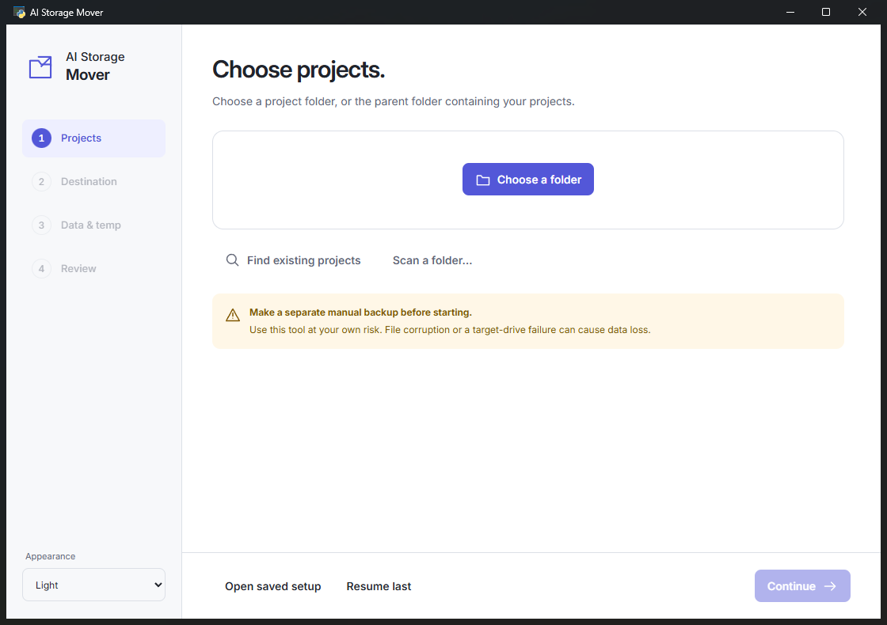
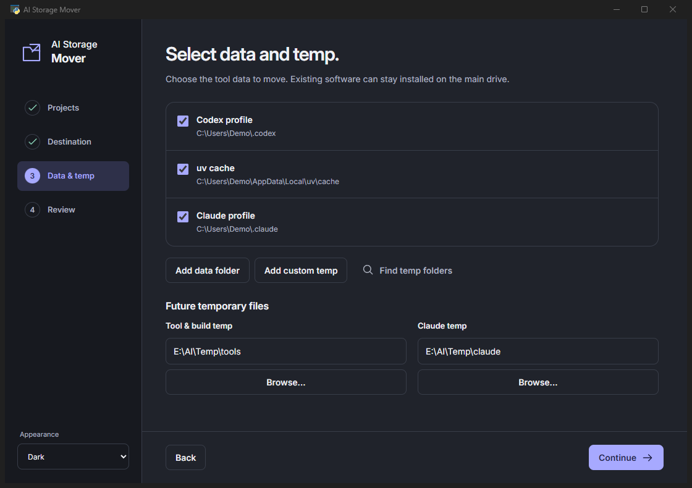
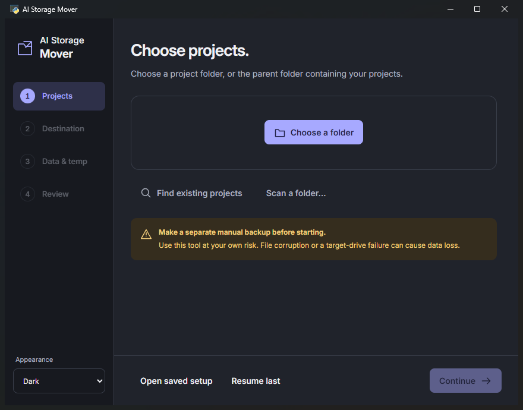
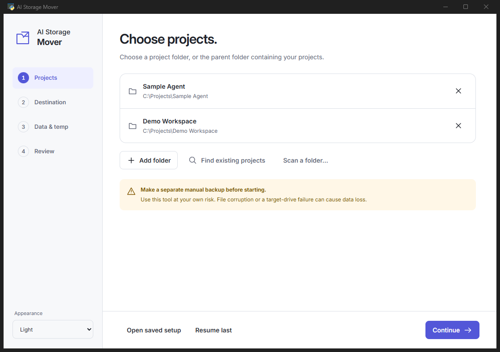
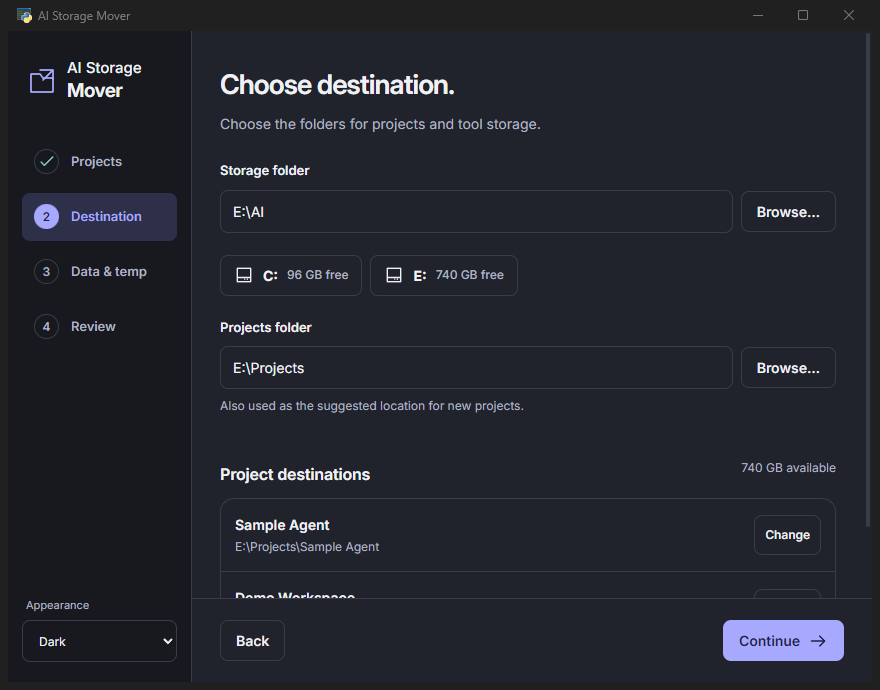
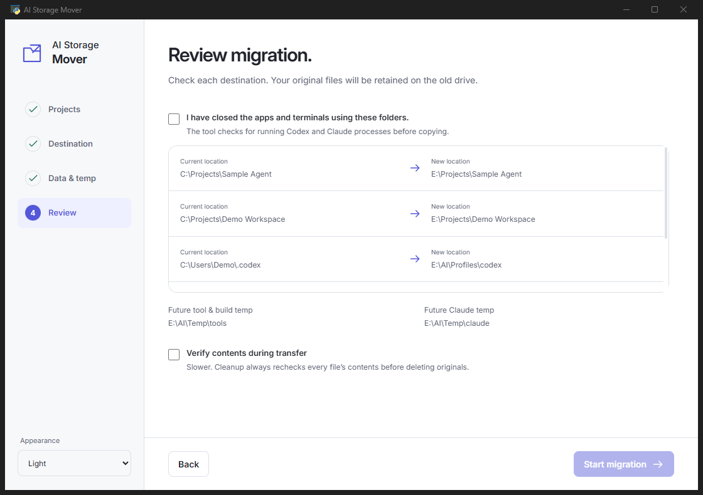
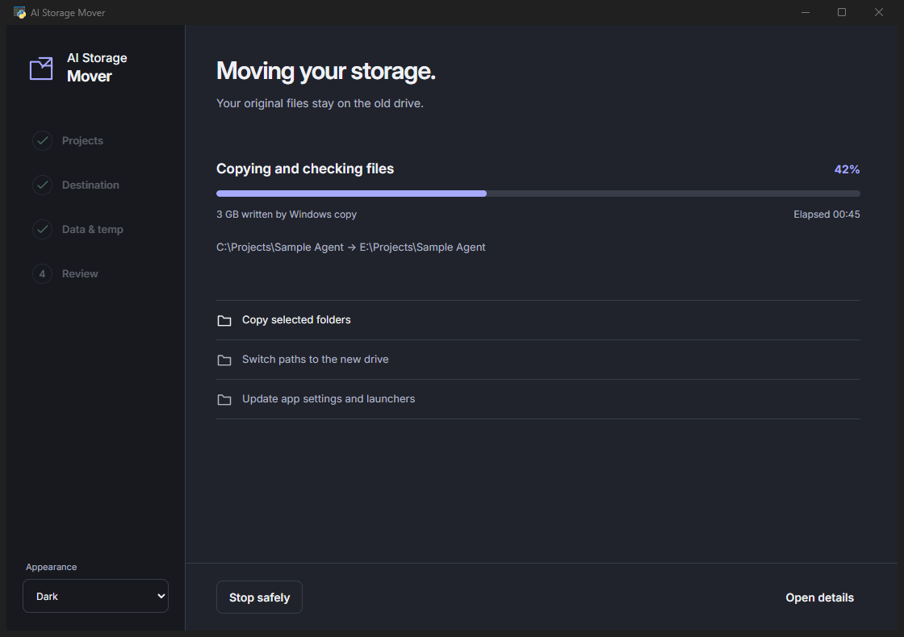
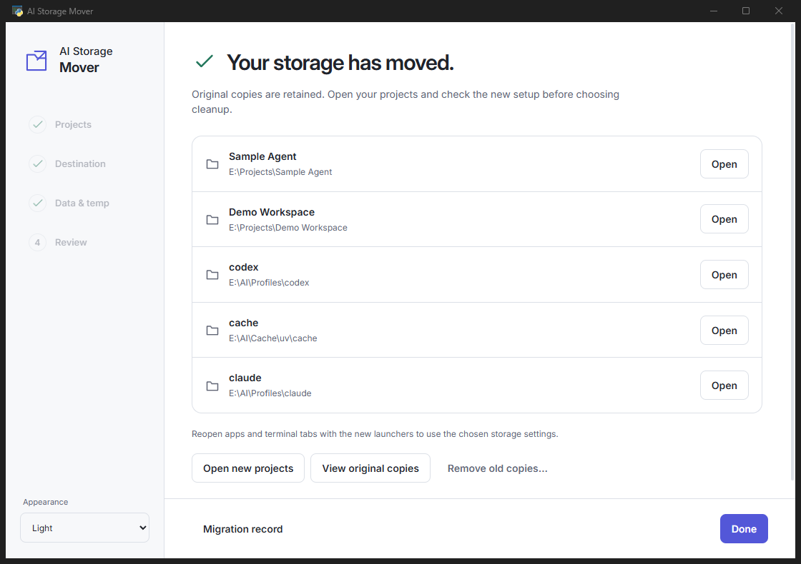
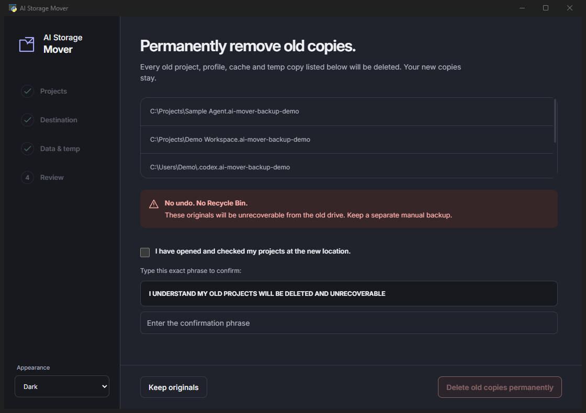

# AI Storage Mover

Move an existing AI and development setup when projects, caches and build files outgrow the main drive. Choose folders in a desktop window; the tool copies your selected data and updates supported app paths and future storage defaults together. Desktop software can stay installed on C: while its projects and supported tool storage use another drive.

**Use at your own risk. Make a separate manual backup before doing anything.** Files can become corrupted and the target drive can fail. Verification and retained originals reduce risk; they do not replace an independent backup or guarantee against data loss. See the [MIT license](LICENSE).

**Upgrade from v0.2.0–v0.2.2 before migrating more data.** Those versions did not fully block manual desktop-profile moves. Redirecting Codex's Roaming profile through a junction was implicated in a severe Windows memory leak. v0.2.3 blocks those moves and includes **Repair Codex**. [What changed and how to repair](docs/CODEX-REPAIR.md).

## Screenshots

Fictional projects, paths and storage figures. Progress is illustrative.

Project selection, destination, review, transfer and cleanup

## Start

1. Download the **Windows x64 ZIP** from [Releases](https://github.com/quorraa/ai-storage-mover/releases/latest).
2. Extract the entire folder and double-click **AI Storage Mover.exe**. Keep its accompanying files together. No Python installation or terminal commands are needed.
3. Select your project folders and the destination. Use **Find existing projects** or **Scan a folder** for suggestions.
4. Select detected profiles, caches and optional custom temp folders. **Add data folder** includes other apps' storage. Review the paths, close the affected apps and terminals, and start the transfer.

The scanner reads known project records and performs a bounded folder search when requested. Multiple matches are offered for selection. It does not crawl every file on every drive.

Use **Change** beside a project destination to reuse an existing copy or choose separate destinations for projects with the same folder name. Appearance follows Windows by default; the theme selector also offers light and dark modes.

The wizard configures future projects, tool/build temp, Claude temp, uv/pip/npm caches, Python bytecode, uv Python/tool installation locations and npm's global prefix. Custom future temp folders are optional. It repairs known Codex/Claude workspace records, MCP tool environment values and Windows launchers. Reopen apps and terminal tabs from the new launchers to inherit the settings.

## Transfer and originals

Fresh Windows directory copies use Robocopy with 16 parallel workers. Existing destinations use the journal to skip unchanged files and preserve conflicting destination files. No mirroring, source deletion, or repeated full-tree setup scans. Speed depends on the drives and file count; no fixed speed multiplier is promised.

**Fast mode** checks file size and modification date, preserving originals. Select **Verify file contents during transfer** for immediate SHA-256 checks. Before tool-managed permanent cleanup, all retained copies must pass content verification; a mismatch keeps the originals. Later changes at the new location can prevent cleanup, leaving the older snapshots available for manual review.

Progress shows measured phases and entry counts. Failed or stopped transfers retain evidence for retry. **Open saved setup** resumes a transfer or reopens a completed run for later cleanup.

Original files stay on the old drive in clearly listed `.ai-mover-backup-...` folders. The former project paths become compatibility links to the new location. Use **View original copies** to open the physical backup folders for manual review/removal; do not mistake compatibility links for the old data.

## Optional permanent cleanup

Keeping originals is the default. After checking your new projects, choose **Remove old copies** if you want the tool to remove them. The app lists the exact old folders, requires a checked-projects acknowledgment, and enables deletion only after you type:

> I UNDERSTAND MY OLD PROJECTS WILL BE DELETED AND UNRECOVERABLE

This removes every selected original project, profile, cache and temp copy listed in that run from the old drive, without using the Recycle Bin. There is no undo in this tool. The new copies stay. Cleanup is never started automatically; the backend also requires the exact phrase.

## Scope

Windows 10/11 x64 is the desktop download target. The desktop bundle includes Python and pywebview, with an offline interface rendered by Microsoft Edge WebView2. If WebView2 is missing, install the [Microsoft WebView2 Evergreen Runtime](https://developer.microsoft.com/en-us/microsoft-edge/webview2/). Fonts and interface assets are bundled; setup does not load a website. The core is Python 3.11+ with no runtime dependencies. The optional offline Claude browser-state adapter requires Node/npm and installs its dependency with scripts disabled.

Windows-managed installers, WindowsApps, private package/sandbox directories, Codex/Claude/ChatGPT desktop profiles and shared Windows temp are not relocated. These desktop profiles stay on the system drive; CLI profiles (`.codex`, `.claude`), projects and supported development caches can move. Windows can still write internal files to C:. Existing virtual environments may retain interpreter paths and need rebuilding; this tool does not silently recreate dependencies. It cannot guarantee every third-party application honors storage settings.

[Advanced CLI / developer guide](docs/CLI.md) · [Validation](docs/VALIDATION.md) · [Limitations](docs/limitations.md) · [Sources](docs/sources.md)
