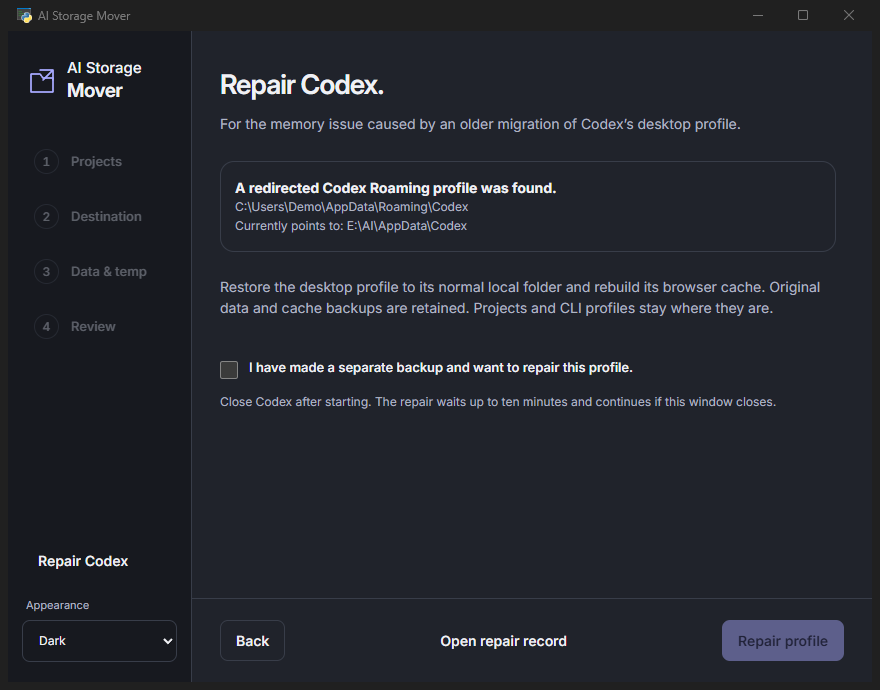

# Codex profile repair

Versions v0.2.0–v0.2.2 did not fully prevent manually selecting Codex's desktop profile or an enclosing folder. Do not use those versions for further migrations. Download v0.2.3 or later.

A cross-volume junction at `%APPDATA%\Codex`, combined with the packaged app's private browser cache, was implicated in repeated cache operations and severe NTFS nonpaged-pool growth. In the observed incident growth stopped after restoring a physical profile folder and preserving/rebuilding the cache. That observation does not establish that every Codex memory problem has this cause.

## Run from the app

1. Make an independent manual backup.
2. Extract the latest Windows ZIP and open **AI Storage Mover.exe**.
3. Choose **Repair Codex → Check this computer**. The check is read-only with respect to your profiles and runs outside the packaged app context.
4. If the affected redirect is found, review the paths, acknowledge your backup, and choose **Repair profile**.
5. Close Codex normally. The worker waits up to ten minutes; it never force-closes apps. You may keep the mover open to see progress or reopen it to see the saved repair status.
6. When the app reports **Codex profile restored**, reopen Codex. If Windows still retains the earlier kernel allocations, restart Windows when convenient. The tool never restarts Windows itself.

No terminal commands are required. **Open repair record** shows the script, status, hashes and a journal of each planned rename. **Cancel repair** requests a stop at a safe checkpoint. A one-shot Windows scheduled task provides independent lifetime, has no automatic recurrence and removes itself when finished. Its maximum lifetime is 30 minutes; cancellation and failures retain originals and evidence. If task cleanup fails, the record contains its exact name for removal in Windows Task Scheduler.

## What changes

Only the current user's known `%APPDATA%\Codex` junction and the corresponding `OpenAI.Codex_*` private browser cache are eligible. The worker checks the actual unpackaged paths, refuses nested redirects, copies the old target into a new local sibling folder, and checks every file with SHA-256. It checks the source again before switching paths. The browser-profile copy is limited to 4 GiB / 100,000 entries and needs another 256 MiB of free space.

The original target stays intact. The junction is renamed to `Codex.junction-before-ai-mover-repair-<id>`. Old `web\Codex\Default\Cache\Cache_Data` directories are renamed to `Cache_Data.before-ai-mover-repair-<id>`; Codex recreates active caches. Accounts, history and other profile contents are preserved. Projects, `CODEX_HOME`, Claude Code and development caches are unchanged.

The successful result means **the folder/cache repair was applied**, not that a memory leak was measured or every app function was tested. Check Codex after reopening. Do not restore the old junction as routine cleanup.

## When the tool stops

A normal physical profile returns **no repair needed**. Custom desktop-profile overrides, multiple/missing package matches, unsupported link types, an unrecognized cache layout, insufficient disk space, nested links, copy mismatches or reopened apps stop the repair. The tool does not guess which signed-in profile is authoritative or reset authentication. Inspect the record and obtain help for these layouts.

The journal is written before every active-path rename. Ordinary failures before installation attempt to restore the previous names only while Codex is closed and no conflicting replacement exists. A power loss or forced OS termination can still interrupt the short rename sequence; staging, source and backups remain. Keep Codex closed and inspect `repair-receipt.json` before manual recovery. Never merge or overwrite profiles blindly.

Use at your own risk. Independent backups remain necessary. The repair does not address unrelated driver leaks, all third-party profiles, or every custom relocation method.
